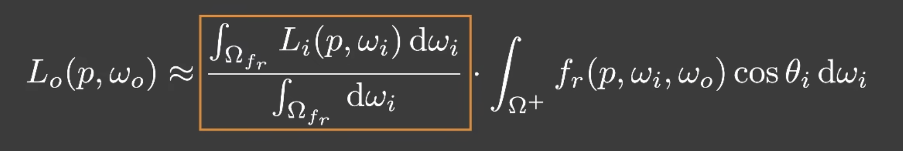
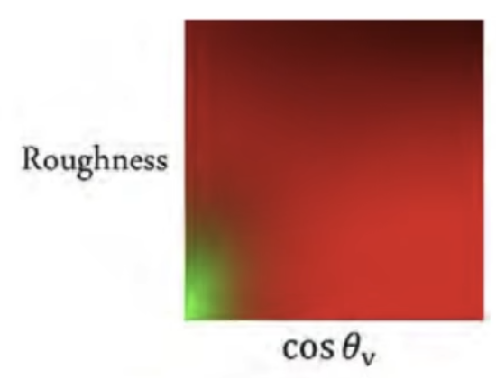
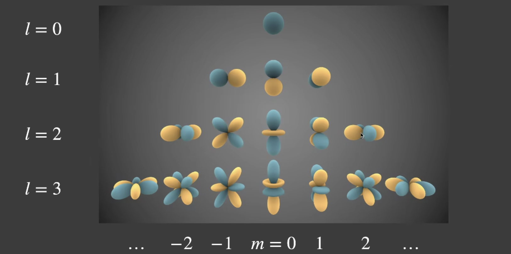

# GAMES202
<!-- TOC -->

- [GAMES202](#games202)
  - [Lecture2 Recap of CG Basics](#lecture2-recap-of-cg-basics)
    - [OpenGL](#opengl)
  - [Lecture3 Real-time shadows](#lecture3-real-time-shadows)
    - [Shadow Mapping](#shadow-mapping)
    - [detached shadow](#detached-shadow)
    - [Inequalities in Calculus](#inequalities-in-calculus)
    - [Approximation in RTR](#approximation-in-rtr)
    - [Percentage-closer Filtering](#percentage-closer-filtering)
    - [Percentage-closer soft shadows](#percentage-closer-soft-shadows)
  - [Lecture4 Real-Time Shadows 2](#lecture4-real-time-shadows-2)
    - [PCSS](#pcss)
    - [Variance Soft Shadow Mapping](#variance-soft-shadow-mapping)
      - [Mean 均值](#mean-均值)
      - [Variance 方差](#variance-方差)
      - [Light leaking](#light-leaking)
    - [Moment Shadow mapping(矩阴影映射)](#moment-shadow-mapping矩阴影映射)
  - [Lecture5 Distance Field Soft Shadow](#lecture5-distance-field-soft-shadow)
    - [Signed distance function 有向距离场](#signed-distance-function-有向距离场)
      - [Usage 1](#usage-1)
      - [Usage 2](#usage-2)
    - [Shading from Environment Lighting](#shading-from-environment-lighting)
    - [Split sum approximation](#split-sum-approximation)
  - [Lecture6 Real-time Environment Mapping](#lecture6-real-time-environment-mapping)
    - [Shadow from Environment Lighting](#shadow-from-environment-lighting)
    - [Spherical Harmonics](#spherical-harmonics)
    - [Recall: Prefiltering](#recall-prefiltering)
    - [Precomputed Radiance Transfer(PRT)](#precomputed-radiance-transferprt)
      - [Diffuse Case](#diffuse-case)
  - [Lecture7 Real-time Global illumination(in 3D)](#lecture7-real-time-global-illuminationin-3d)
    - [PRT](#prt)
      - [Glossy Case](#glossy-case)
      - [Precomp of light transport](#precomp-of-light-transport)
      - [limitation](#limitation)
    - [Wavelet](#wavelet)
    - [Real-Time Global illumination (in 3D)](#real-time-global-illumination-in-3d)
    - [Reflective Shadow Maps(RSM)](#reflective-shadow-mapsrsm)
      - [$L_i$ 计算](#l_i-计算)
      - [visibility 计算](#visibility-计算)
      - [简化计算](#简化计算)
      - [总结](#总结)
  - [Lecture8 Real-time Global illumination(screen space)](#lecture8-real-time-global-illuminationscreen-space)
    - [Light Propagation Volumes(LPV)](#light-propagation-volumeslpv)
      - [Steps 1 Generation](#steps-1-generation)
      - [Steps 2: injection](#steps-2-injection)
      - [Steps 3: Propagation](#steps-3-propagation)
      - [Steps 4: Rendering](#steps-4-rendering)
    - [Voxel Global Illumination (VXGL)](#voxel-global-illumination-vxgl)
      - [Pass 1 from light](#pass-1-from-light)
    - [Screen Space Ambient Occlusion(SSAO)](#screen-space-ambient-occlusionssao)

<!-- /TOC -->
## Lecture2 Recap of CG Basics

### OpenGL

类比画油画

+ 放置目标物体
  + 模型顶点
  + 模型变换
    + 平移
    + 缩放
    + 旋转
  + 使用 vertex buffer object
    + 顶点位置
    + 法线向量
    + 切线向量
    + 纹理坐标
+ 确定画架
  + 视图变换矩阵
    + view frustum
      + 垂直视野 fov
      + 纵横比 aspect ratio
      + 近平面
      + 远平面
  + 使用 framebuffer
+ 设置画布
  + 设置目标纹理，在一个 framebuffer 下可以绘制出多张纹理，也可以直接绘制到屏幕上
  + 在真实游戏中，一般不会直接将渲染结果输出到屏幕上。而是放在缓冲里，常见的有使用双重缓冲以及三重缓冲两种模式。这个在游戏选项里一般叫做垂直同步。
+ 在画布上绘制
  + vertex shader
    + 输入是 vbo 中的每个顶点携带各个值
    + 设置需要插值的值
    + 设置 mvp 变换
  + fragment shader
    + 这里的输入是 verterx shader 的输出并插值到三角形内的每一个 fragment 上
    + 插值是由光栅化阶段完成的，通过使用三角形重心坐标对三角形进行插值
    + 深度测试
+ 重新设置画架位置，重新设置画布继续绘制（shadowmap）
+ 将先前的画作为后续绘制素材继续用（预渲染）
  + shadowmap

## Lecture3 Real-time shadows

### Shadow Mapping

### detached shadow

使用 shadow bias 

当 shadow bias 值过大的时候会造成阴影悬空，这个时候需要使用正面剔除，来修复这个问题

### Inequalities in Calculus

柯西-施瓦茨不等式

闵可夫斯基不等式

### Approximation in RTR

在实时渲染中，不等式一般当作约等来用

$$\int_{\Omega}^{} f(x)g(x){\rm d}x \approx \frac{\int_{\Omega}^{} f(x){\rm d}x}{\int_{\Omega}^{}{\rm d}x} \cdot \int_{\Omega}^{} g(x){\rm d}x$$

$f(x) = 2$ 在 [0, 3] 区间上积分，代入

满足一下条件时这个约等式比较准确
+ 当 g(x) 足够光滑，低频，会比较接近
+ 当 g(x) 积分项的积分区间是比较小的时候

将 visibility 提出来

+ 在点光源的情况下（积分区间最小），这个近似是比较准确的
+ 当面光源的情况下，第二项是低频。或者 brdf 在 diffuse 情况下，第二项也是低频

### Percentage-closer Filtering

用于阴影抗锯齿

将 shading point 周围的点的都查询 shadow maping，获取对应深度，将所有的深度与 shading point 的实际深度坐比较，将比较结果进行加权平均

### Percentage-closer soft shadows

普通 shadow mapping 只能产生硬阴影，当日常生活绝大多数光源是面光源，面光源产生的是软阴影

阴影的软硬与遮挡物到展示阴影平面的距离有关，距离越近阴影越硬，距离越远阴影越软

+ Step 1: Blocker search

  getting the average blocker depth **in a certain region**

+ Step 2: Penumbra estimation

  use the average blocker depth to determine filter size

+ Step 3: Percentage closer filtering

## Lecture4 Real-Time Shadows 2

### PCSS

step 1 Block search 获得遮挡物的平均深度，就可以估算出 step 3 PCF 的 filtering 的区域大小。

### Variance Soft Shadow Mapping

在 Step 3 中的加权平均运算，可以看作求一场考试中自己分数的排名

这个问题可以近似看作是在一个正太分布中查询大于某个分数的概率

为了求解这个问题，我们需要知道这个正太分布的均值和方差

#### Mean 均值

+ MIPMAP
+ Summed Area Tables(SAT)
  + 二维前缀和

#### Variance 方差

$${\rm Var}(X) = E(X^{2})-E^{2}(X)$$

在渲染深度纹理时同时积算深度的平方并记录在纹理上某一个rgba其中一个分量上，对这个纹理做 MIPMAP 就能拿到 $E(X^{2})$ 与 $E^{2}(X)$ 的值

CDF 没有解析解，但有数值解，通过查表可得，但这个方法过于麻烦

切比雪夫不等式

$$P(x > t) \leq \frac{\sigma^{2}}{\sigma^{2}+(t - \mu)^{2}}$$

$\sigma$ 为 variance

$\mu$ 为 mean

这里解决了第三步，但是如果光源出现移动，或者场景移动都需要重新计算

Step 1 Block Seaqrch

$$ \frac{N_{unocc}}{N} z_{unocc} + \frac{N_{occ}}{N}z_{occ} = z_{Avg}$$

$z_{Avg}$ 为整体深度均值

$\frac{N_{unocc}}{N} = P(x > t)$ 通过切比雪夫不等式近似

$\frac{N_{occ}}{N} = 1 - \frac{N_{unocc}}{N}$

$z_{unocc}$ 假色为 shading point 的深度

#### Light leaking

当遮挡物分布并不是一个正太分布，而是某种离散分布时会导致 artifact

### Moment Shadow mapping(矩阴影映射)

为了解决 vsm 深度分布描述不准确的问题

在 vsm 我们使用 $depth$ 和 $depth^2$，来描述深度分布，但仅有这两项并不能很好的还原深度分布

在 msm 中将增加 $depth^3, depth^4,...$ 来描述深度分布，使深度分布函数更贴合实际。这里可以理解为将深度函数用级数展开，级数项越多，拟合程度越高。

## Lecture5 Distance Field Soft Shadow

### Signed distance function 有向距离场

Optimal Transport

#### Usage 1

Ray matching

给定一个光源位置，以及光线方向，通过查询 SDF 得到最小安全距离，向关系方向移动最小距离，重新查询 SDF 得到当前位置的最小安全距离。重复步骤得到光线的交点

#### Usage 2

Use SDF to determine the percentage of occlusion

和 usage 1 方法查询点 $p$，查询过程中以最小半径 ${\rm SDF}(p)$ 做圆，过起始点与圆做切线，起始点 $o$ 与圆心距离为 $|p - o|$ 那么夹角 $\theta = arccos(\frac{{\rm SDF}(p)}{p-o})$ 圆与向量 $\overrightarrow{op}$ 的交点为下一个迭代点 $p_2$，对几个点依次计算，最后比较得到最小夹角

反三角函数运算过于**巨大**，用斜边比领边的比值近似这个角度

### Shading from Environment Lighting

+ Monte Carlo integration

    too slow

+ BRDF approximation
  
    

### Split sum approximation

+ Prefiltering of the environment lighting

    这里对上图黄色方框里的项做一次预计算，生成纹理

+ pre caculate LUT texture

    将上图右侧积分变形乘以 F (菲涅尔项) 再除以 F，这里使用 Fresnel-Schlick 近似

    $$ F_{Schlick}(h,v,F_{0}) = F_{0} + (1 - F_{0})(1 - (h \cdot v)^5)$$

    $$\int_{\Omega^{+}}^{} f_{r}(p,\omega_{i},\omega_{o}) cos\theta_i {\rm {d}} \omega_i \approx F_0 \int_{\Omega^{+}}^{} \frac {f_r}{F} (1-(1-cos\theta_i)^5)cos\theta_i {\rm {d}} \omega_i +
    \int_{\Omega^{+}}^{} \frac {f_r}{F} (1-cos\theta_i)^{5} cos\theta_{i} {\rm {d}} \omega_i$$

    $F_0$ 提取出来后，内部就剩 $\theta$ 与 Roughness，故积分自变量为  $\theta$ 与 Roughness，积分值为一个颜色，可以生成一张纹理

    

    避免了采样这个过程

## Lecture6 Real-time Environment Mapping

### Shadow from Environment Lighting

+ Related research
  + Imperfect shadow maps
  + Light cuts （将场景中的其他物体当作光源，来计算目标物体上颜色）
  + RTRT (Real-time ray tracing might be the ultimate solution)
  + Precomputed radiance transfer

### Spherical Harmonics

本质将球面函数，进行拆分，类似于傅立叶级数，把球面函数写成几个基函数线性叠加的形式

由于基函数之间，两两点乘结果为0，可以理解为两两基函数正交。类比三维空间中，向量坐标三个分量的值是该向量在三维空间中两两正交的坐标轴上投影的长度。那么这种拆分可以看作将函数投影到两两正交的基函数上

任意一个球面函数$f(\omega)$，他的每一个基函数 $B_i$ 前面的系数为

$$c_i= \int_{\Omega}^{} f(\omega)B_i(\omega) {\rm d}\omega$$

这里系数其实就是在基函数上投影的值，所以这个计算可以转化成：空间中某一个向量在基向量上的投影，也就是向量点积

+ sh 对于高频信息的还原比较差，需要非常多的项才能还原出高频部分
+ 支持旋转，被投影函数旋转后，能快速得倒新的基函数系数

### Recall: Prefiltering

计算场景中的某个点在 diffuse 下的 shading

可以利用环境光贴图的 SH 下的前三项（低频信号），由于只取前三项来近似光照。这个方法去掉了高频信号，原来的环境光贴图会产生模糊的效果，这种模糊刚好就是 diffuse 下需要的，只要对环境贴图做 prefilter 之后实际渲染只要直接查询这张处理过图像上对应点的颜色就能直接得到结果

### Precomputed Radiance Transfer(PRT)

+ Handles shadows and global illumination

$$
L(o)= \int_{\Omega}^{} L(i)V(i)\rho(i, o)max(0, n \cdot i){\rm d}i
$$

$L(i)$ 表示 light

$V(i)$ 表示 visibility

$\rho(i, o)max(0, n \cdot i)$ 表示 BRDF，入射方向，放射方向，这里两个空间方向都用 $\theta$ $\phi$ 表示，故 BRDF 是 4 维函数

+ Approximate light using basis functions

    $L(i) \approx \sum l_iB_i(\omega)$

+ Precomputation stage

    积分剩余的部分对于一个 shading point 其实是不变的，就可以预计算。这种方式要求场景中的**物体是静止**的，且相机**视角也是静止**的

#### Diffuse Case

$$
\begin{aligned}
L(o) =& \rho \int_{\Omega}^{} L(i)V(i)max(0, n \cdot i){\rm d}i \\
    \approx& \rho \sum l_i \int B_i(i)V(i)max(0, n \cdot i){\rm d}i \\
    \approx& \rho \sum l_i T_i
\end{aligned}
$$

由于 $\rho$ BRDF 是一个常值，可以直接提取到积分外部

由于 $V(i)max(0, n \cdot i)$ 为一个球面函数，球面函数与基函数的点积，就是该球面函数在谋个基函数上投影的系数 $T_i$

由于 $V(i)max(0, n \cdot i)$ 被预计算，故场景中物体必须是静止的，否则需要重新计算

由于 $L(i)$ 被预计算，光源必须固定的

## Lecture7 Real-time Global illumination(in 3D)

### PRT

#### Glossy Case

$$
\begin{aligned}
L(o) =& \int_{\Omega}^{} L(i)V(i)\rho(i, o)max(0, n \cdot i){\rm d}i \\
 \approx& \sum l_iT_i(o) \\
 \approx& \sum (\sum l_it_{ij}(o))B_j(o)
\end{aligned}
$$

将 light transport 投影到球谐函数上 $T_i(o) \approx \sum t_{ij}B_j(o)$

这里 $\sum t_{ij}$ 这里可以看作是一个矩阵叫做 transport matrix，描述光线从 $i$ 方向道 $o$ 方向的一个转换 

代价：

+ 任何一个顶点都要存一个二维矩阵 transport matrix，假设是 5 阶 SH basis 函数(5阶SH 有 $5^2$ 个基函数)，那就是 25 * 25 = 625 个数
+ 矩阵乘法也会耗费更多的性能

#### Precomp of light transport

$$
\text{light transport} \qquad T_i = \int_{\Omega} B_i(i)V(i)max(0, n \cdot i ){\rm d}i
$$

这里 light transport 的预计算就可以把基函数当作光线，代入渲染方程，得到结果

#### limitation

+ Dynamic lighting, but static scene/material
+ Big precomputation data
+ Low-frequency
### Wavelet

+ 二维基函数，可以对全频率信息进行还原
+ 但不支持快速旋转，这意味着光线需要固定

小波变换类似的 离散余弦变换 是 jpeg 的压缩变换

[jpeg 压缩原理](https://www.zhihu.com/zvideo/1510204586644664321)

每次投影，将高频信息保留

### Real-Time Global illumination (in 3D) 

In RTR, people seek simple and fast solutions to one bounce indirect illumation

任意一点的颜色 = 直接光照 + 被直接光照照亮的地方作为光源，对该点进行二次光照

+ 通过 shadow map 查询，那些区域是被直接照亮
+ 这些小的区域又是如何对 p 点贡献

### Reflective Shadow Maps(RSM)

通过 shadow map 可以知道被直接照亮的点，那么这些被直接照亮的点，就可以被当作间接光源

$$
\begin{aligned}
L_o(p, \omega_o) &= \int_{\Omega_{patch}} L_i(p,\omega_i)V(p, \omega)f_r(p, \omega_i, \omega_o)cos\theta_i{\rm d}\omega_i \\
&= \int_{A_{patch}} L_i(q \to p) V(p, \omega_i) f_r(p, q \to p, \omega_o)\frac{cos\theta_p cos\theta_q}{||q-o||^2} {\rm d}A
\end{aligned}
$$

#### $L_i$ 计算

对于 p 点来说 $L_i(q \to p)$

+ $f_r = \rho/\pi$ p 点的BRDF
+ $L_i = f_r \cdot \frac{\Phi}{dA}$ 根据 BRDF 的定义，BRDF 等于 出射的 Radiance / 入射的 Irradiance，这里 $L_i$ 就是 q 点的出射， $\Phi$ 就是 q 点的入射，也就是光源的直接照射

#### visibility 计算

$V(p, \omega_i)$ 比较复杂，**直接省略，大胆近似**

#### 简化计算

正常来说，要计算对于 p 点所有贡献的 q ,即在 RSM 中所有像素点

如何查找 shadaing point 附近的 area 对他

shadaing point 反向投影到 shadow map 上，查找其附近区域的点。即深度比较接近的点，那么世界坐标就比较接近

#### 总结

RSM 其实就是一张shadow map 需要存储

+ 深度
+ 世界坐标用于计算两点间的距离
+ 法线用于计算 cos 项
+ flux 也就是 $\Phi$ 项

优点
+ 实现简单
  
缺点
+ 没有计算 visibility 项
+ 每一个光源都要生成一张 map

## Lecture8 Real-time Global illumination(screen space)

### Light Propagation Volumes(LPV)

基础物理依赖 radiance 在传播中不会衰减

将空间分割为一个一个小正六面体，以直接照亮的点作为间接光源，计算每个格子的 radinace, 并向正六面体的6个方向传播

#### Steps 1 Generation

+ 找到微平面
+ 如同 RSM 寻找次级光源所在的微平面（和 RSM 一样无法处理多光源问题，每个光源，都需要单独生成一张 shadow map）
+ 可能会做一些采样，减少微平面数量

#### Steps 2: injection

+ 将场景划分为3D的格子(三维的纹理)
+ 将格子中的所有的次级光源相加，并作为格子的 radiance，再通过 SH (前两阶)去模拟

问题
+ SH 仅用两节差异较大，并且得不到 glossy 的结果
+ 光线照射到格子内物体的 radiance 当作整个格子的 radiance（这里会发生漏光，假设格子里有一面墙，那么这面墙的前后面的 radinace 都是一样的，会一样的亮，但是光线仅能照射到墙的其中一个面，墙是一种非常细的几何，比格子还要小）

#### Steps 3: Propagation

+ 由于光线沿直线传播，通过格子某一个面的 radiance 就朝这个方向传播
+ 接收盒子直接将 radiance 相加，并用 SH 去模拟
+ 通过迭代(大致4～5次)，得到最终稳定值(这里为什么会收敛呢)

#### Steps 4: Rendering

+ 对每一个 shading point 找到它所在的格子
+ 查询格子的 radiance 属性
+ rendering

### Voxel Global Illumination (VXGL)

two-pass algorithm

与 RSM 不同

+ 这里场景中次级光源为不同的格子，RSM 中为纹理中的像素
+ 相机与 shading point 链接，通过材质确定反射范围，计算反射范围覆盖的格子，在计算这些格子对 shading point 的贡献（glossy 材质，反射范围是一个圆锥，但是 diffuse 材质，反射范围是一个半球，这时用 8个圆锥来拟合这个半球，做一个近似）

#### Pass 1 from light

shadow map 的方式计算直接光照照亮的格子

问题

+ 格子实时划分，耗时较大

### Screen Space Ambient Occlusion(SSAO)

+ 假设四面八方的环境光照是一个常量
+ 每一个 shadaing point 并不能接受所有方向的环境关照，存在一定遮挡关系
+ 物体是 diffuse

$$L_o(p, \omega_o) = \int_{\Omega_{patch}} L_i(p,\omega_i)V(p, \omega)f_r(p, \omega_i, \omega_o)cos\theta_i{\rm d}\omega_i$$

