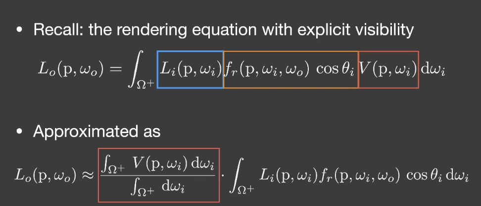

# GAMES202

## Lecture2 Recap of CG Basics

### OpenGL

类比画油画

+ 放置目标物体
  + 模型顶点
  + 模型变换
    + 平移
    + 缩放
    + 旋转
  + 使用 vertex buffer object
    + 顶点位置
    + 法线向量
    + 切线向量
    + 纹理坐标
+ 确定画架
  + 视图变换矩阵
    + view frustum
      + 垂直视野 fov
      + 纵横比 aspect ratio
      + 近平面
      + 远平面
  + 使用 framebuffer
+ 设置画布
  + 设置目标纹理，在一个 framebuffer 下可以绘制出多张纹理，也可以直接绘制到屏幕上
  + 在真实游戏中，一般不会直接将渲染结果输出到屏幕上。而是放在缓冲里，常见的有使用双重缓冲以及三重缓冲两种模式。这个在游戏选项里一般叫做垂直同步。
+ 在画布上绘制
  + vertex shader
    + 输入是 vbo 中的每个顶点携带各个值
    + 设置需要插值的值
    + 设置 mvp 变换
  + fragment shader
    + 这里的输入是 verterx shader 的输出并插值到三角形内的每一个 fragment 上
    + 插值是由光栅化阶段完成的，通过使用三角形重心坐标对三角形进行插值
    + 深度测试
+ 重新设置画架位置，重新设置画布继续绘制（shadowmap）
+ 将先前的画作为后续绘制素材继续用（预渲染）
  + shadowmap

## Lecture3 Real-time shadows

### Shadow Mapping

### detached shadow

使用 shadow bias 

当 shadow bias 值过大的时候会造成阴影悬空，这个时候需要使用正面剔除，来修复这个问题

### Inequalities in Calculus

柯西-施瓦茨不等式

闵可夫斯基不等式

### Approximation in RTR

在实时渲染中，不等式一般当作约等来用

$$\int_{\Omega}^{} f(x)g(x){\rm d}x \approx \frac{\int_{\Omega}^{} f(x){\rm d}x}{\int_{\Omega}^{}{\rm d}x} \cdot \int_{\Omega}^{} g(x){\rm d}x$$

$f(x) = 2$ 在 [0, 3] 区间上积分，代入

满足一下条件时这个约等式比较准确
+ 当 g(x) 足够光滑，低频，会比较接近
+ 当 g(x) 积分项的积分区间是比较小的时候

将 visibility 提出来

+ 在点光源的情况下（积分区间最小），这个近似是比较准确的
+ 当面光源的情况下，第二项是低频。或者 brdf 在 diffuse 情况下，第二项也是低频

### Percentage-closer Filtering

用于阴影抗锯齿

将 shading point 周围的点的都查询 shadow maping，获取对应深度，将所有的深度与 shading point 的实际深度坐比较，将比较结果进行加权平均

### Percentage-closer soft shadows

普通 shadow mapping 只能产生硬阴影，当日常生活绝大多数光源是面光源，面光源产生的是软阴影

阴影的软硬与遮挡物到展示阴影平面的距离有关，距离越近阴影越硬，距离越远阴影越软

+ Step 1: Blocker search

  getting the average blocker depth **in a certain region**

+ Step 2: Penumbra estimation

  use the average blocker depth to determine filter size

+ Step 3: Percentage closer filtering

## Lecture4 Real-Time Shadows 2

### PCSS

step 1 Block search 获得遮挡物的平均深度，就可以估算出 step 3 PCF 的 filtering 的区域大小。

### Variance Soft Shadow Mapping

在 Step 3 中的加权平均运算，可以看作求一场考试中自己分数的排名

这个问题可以近似看作是在一个正太分布中查询大于某个分数的概率

为了求解这个问题，我们需要知道这个正太分布的均值和方差

#### Mean 均值

+ MIPMAP
+ Summed Area Tables(SAT)
  + 二维前缀和

#### Variance 方差

$${\rm Var}(X) = E(X^{2})-E^{2}(X)$$

在渲染深度纹理时同时积算深度的平方并记录在纹理上某一个rgba其中一个分量上，对这个纹理做 MIPMAP 就能拿到 $E(X^{2})$ 与 $E^{2}(X)$ 的值

CDF 没有解析解，但有数值解，通过查表可得，但这个方法过于麻烦

切比雪夫不等式

$$P(x > t) \leq \frac{\sigma^{2}}{\sigma^{2}+(t - \mu)^{2}}$$

$\sigma$ 为 variance

$\mu$ 为 mean

这里解决了第三步，但是如果光源出现移动，或者场景移动都需要重新计算

Step 1 Block Seaqrch

$$ \frac{N_{unocc}}{N} z_{unocc} + \frac{N_{occ}}{N}z_{occ} = z_{Avg}$$

$z_{Avg}$ 为整体深度均值

$\frac{N_{unocc}}{N} = P(x > t)$ 通过切比雪夫不等式近似

$\frac{N_{occ}}{N} = 1 - \frac{N_{unocc}}{N}$

$z_{unocc}$ 假色为 shading point 的深度

#### Light leaking

当遮挡物分布并不是一个正太分布，而是某种离散分布时会导致 artifact

### Moment Shadow mapping(矩阴影映射)

为了解决 vsm 深度分布描述不准确的问题

在 vsm 我们使用 $depth$ 和 $depth^2$，来描述深度分布，但仅有这两项并不能很好的还原深度分布

在 msm 中将增加 $depth^3, depth^4,...$ 来描述深度分布，使深度分布函数更贴合实际。这里可以理解为将深度函数用级数展开，级数项越多，拟合程度越高。

## Lecture5 Distance Field Soft Shadow

### Signed distance function 有向距离场

Optimal Transport

#### Usage 1

Ray matching

给定一个光源位置，以及光线方向，通过查询 SDF 得到最小安全距离，向关系方向移动最小距离，重新查询 SDF 得到当前位置的最小安全距离。重复步骤得到光线的交点

#### Usage 2

Use SDF to determine the percentage of occlusion

和 usage 1 方法查询点 $p$，查询过程中以最小半径 ${\rm SDF}(p)$ 做圆，过起始点与圆做切线，起始点 $o$ 与圆心距离为 $p - o$ 那么夹角 $\theta = arccos(\frac{{\rm SDF}(p)}{p-o})$ 对几个点依次计算，最后比较得到最小夹角

反三角函数

## Lecture6 Real-time Environment Mapping

### Shadow from Environment Lighting

+ Related research
  + Imperfect shadow maps
  + Light cuts （将场景中的其他物体当作光源，来计算目标物体上颜色）
  + RTRT (Real-time ray tracing might be the ultimate solution)
  + Precomputed radiance transfer

### Spherical Harmonics

本质将球面函数，进行拆分，类似于傅立叶级数，把球面函数写成几个基函数线性叠加的形式

由于基函数之间，两两点乘结果为0，可以理解为两两基函数正交。类比三维空间中，向量坐标三个分量的值是该向量在三维空间中两两正交的坐标轴上投影的长度。那么这种拆分可以看作将函数投影到两两正交的基函数上

### Recall: Prefiltering

计算场景中的某个点在 diffuse 下的 shading

可以利用环境光贴图的 SH 下的前三项（低频信号），由于只取前三项，去掉了高频信号，原来的环境光贴图会产生模糊的效果，这种模糊刚好就是 diffuse 下需要的，只要对环境贴图做 prefilter 之后实际渲染只要直接查询这张处理过图像上对应点的颜色就能直接得到结果

### Precomputed Radiance Transfer

$$
L(o)= \int_{\Omega}^{} L(i)V(i)\rho(i, o)max(0, n \cdot i){\rm d}i
$$

$L(i)$ 表示 light

$V(i)\rho(i, o)max(0, n \cdot i)$ 表示 light transport

预计算

$L(i) = $
