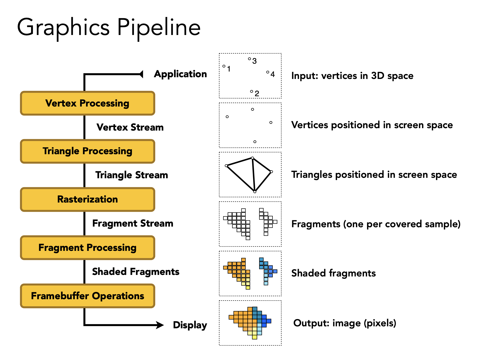
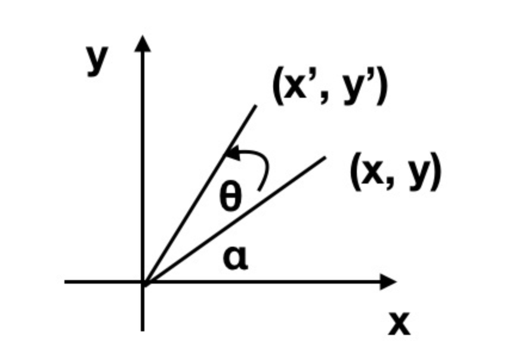
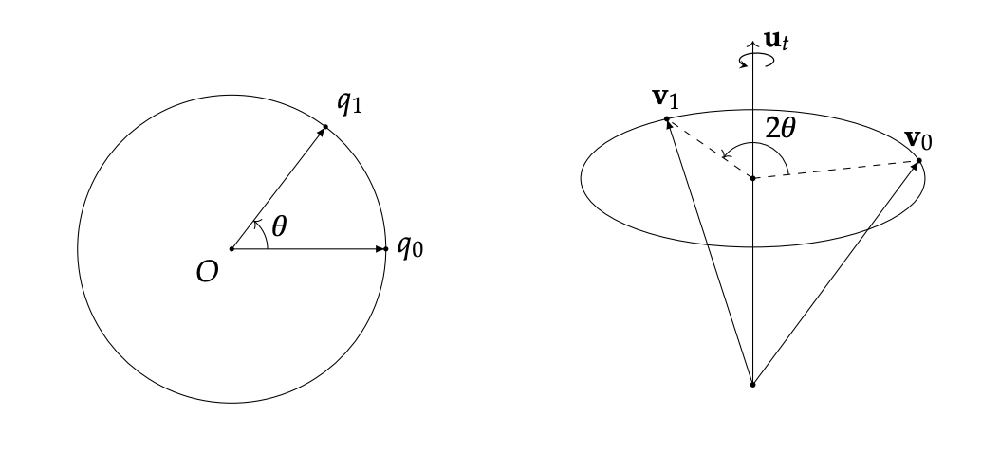
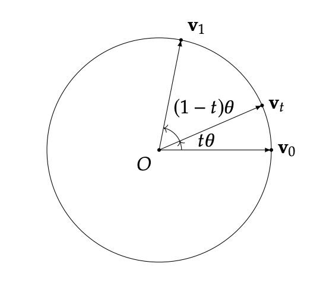

# 快速笔记

## GPU pipeline rendering

### Classic graphics cards

1. Application
2. Geometry
    > 1. Definitions
    > 2. The World Coordinate System
    > 3. Camera Transformation
    > 4. Projection
    > 5. Lighting
    > 6. Cilpping
    > 7. Window-Viewport transfromation
3. Rasterization
4. screen

### Modern graphics cards

Modern graphics cards use a freely programmable, shader-controlled pipeline, which allows direct access to individual processing steps. To relieve the main processor, additional processing steps have been moved to the pipeline and the GPU.

### Graphics Pipeline

base on GAMES 101

### OpenGL Graphics Pipeline

1. Vertex Specification
    1. Vertex Rendering
2. Vertex Processing
    1. Vertex Shader
    2. Tessellation
    3. Geometry Shader
3. Vertex Post-Processing
    1. Transfrom Feedback
    2. Primitive assembly
    3. Clipping
    4. Face Culling
4. Rasterization
5. Fragment Processing
7. Per-Sample Operations

#### 参考资料
[rendering_pipeling_overview](https://www.khronos.org/opengl/wiki/Rendering_Pipeline_Overview)

### Vulkan Graphics Pipeline

#### 参考资料
[vulkan_Graphics_pipeline_basic](https://vulkan-tutorial.com/Drawing_a_triangle/Graphics_pipeline_basics/Introduction)

## geometry shader

+ points: when drawing GL_POINTS primitives (1).
+ lines: when drawing GL_LINES or GL_LINE_STRIP (2).
+ lines_adjacency: GL_LINES_ADJACENCY or GL_LINE_STRIP_ADJACENCY (4).
+ triangles: GL_TRIANGLES, GL_TRIANGLE_STRIP or GL_TRIANGLE_FAN (3).
+ triangles_adjacency : GL_TRIANGLES_ADJACENCY or + GL_TRIANGLE_STRIP_ADJACENCY (6).

## Shadow Map Antialiasing

### Percentage-Closer Filtering

#### box filtering （领近采样）

将阴影四周9个fragment的颜色相加求均值即为当前的阴影颜色。

效果一般，只能减轻这种锯齿，但由于还是每个fragment单一颜色，还是会有锯齿存在。并且在类似栏杆物体的具有间隙的阴影会糊成一片

#### bilinear interpolation（双线性插值）

// tood

#### Poisson Disk

### Percentage Closer Soft Shadows

### 参考文献

[实时阴影技术总结](https://zhuanlan.zhihu.com/p/45805097)

## Cascaded Shadow Maps

## NormalMap

将法线存入在纹理图片会导致，纹理图片显示蓝色，这是用于物体表面法线默认为 z 轴，故大部分法线也是朝向 z 轴及(0, 0, 1)这种坐标转换为 grb 三个分量，刚好 b 分量为 1 即为蓝色

也是由于这个原因法线默认朝 z 轴，那么当表面法线朝向改变时，纹理的坐标是不变的，这个时候需要一个切线矩阵，将光线变换到切线空间，就能与 z 轴朝向的法线进行计算，得到更真实的光照效果

这里的切线矩阵，实际就是表面（三角形）的一个正交矩阵，通过计算的到的三个分量，有可能不正交（这里计算过程略）。这个时候需要施密特正交化(Gram-Schmidt process)，将向量转换为正交向量

## Euler Angle 欧拉角

$$ R_z(\alpha) = \begin{bmatrix} cos\alpha & -sin\alpha & 0 \\ sin\alpha & cos\alpha & 0 \\ 0 & 0 & 1 \\ \end{bmatrix} $$

$$ R_x(\alpha) = \begin{bmatrix} cos\alpha & -sin\alpha & 0 \\ sin\alpha & cos\alpha & 0 \\ 0 & 0 & 1 \\ \end{bmatrix} $$

$$ R_z(\alpha) = \begin{bmatrix} cos\alpha & -sin\alpha & 0 \\ sin\alpha & cos\alpha & 0 \\ 0 & 0 & 1 \\ \end{bmatrix} $$

## Quaternions 四元数

### 复数与二维平面旋转

$z_1 = a + bi$, $z_2 = c + di$ 为任意两个复数

#### 复数加法

$z_1 + z_2 = (a + bi) + (c + di) = (a + c) + (c + d)i$

复数的加法满足交换律和结合律，复数加法得到的结果仍然是一个复数

#### 复数减法

$z_1 - z_2 = (a + bi) - (c + di) = (a - c) + (c - d)i$

复数减法的结果仍然是一个复数

#### 虚数乘法

$$
\begin{aligned}
z_1 * z_2 &= (a + bi) * (c + di) \\
&= ac + adi + bci - bd \\
&= (ac - bd) + (ad + bc)i \\
\end{aligned}
$$

#### 复数乘法与旋转

虚数 Q(x, y) 旋转至 T(x', y')，旋转角度为 $\theta$， 由于 Q, T 长度相同仅仅方向不同，可以用极坐标表示 Q( $rcos\alpha$, $rsin\alpha$), T( $rcos(\alpha + \theta)$, $rsin(\alpha + \theta)$)

展开代入得

$x' = xcos\theta - ysin\theta$

$y' = xsin\theta + ycos\theta$

也就是：

$
\begin{bmatrix}
cos\theta&-sin\theta\\
sin\theta&cos\theta\\
\end{bmatrix} 
\begin{bmatrix}
x\\y\\
\end{bmatrix}
$

### 四元数

#### 四元数点积

假设两个四元数 $q[a, \sf u]$, $p[t, \sf v]$，则

$$
\begin{aligned}
q\cdot p &= at + \sf u \cdot \sf v\\
\end{aligned}
$$

可以看到四元数内积和向量内积类似，返回一个标量

##### 四元数乘法

假设两个四元数 $q(a, b, c, d)$, $p(e, f, g, h)$，则

$$
\begin{aligned}
qp = 
\end{aligned}
$$

四元数乘法不满足交换律。但是满足**结合律**以及**分配律**

但其中有一种特殊的四元数满足交换律，即共轭四元数

#### 共轭四元数

一个四元数 $q = a + bi + cj + dk$ 的**共轭**为 $q^* = a - bi - cj - dk$

标量向量序对表示 $q = [s, v]$， $q^* = [s, -v]$

$$
\begin{aligned}
qq^* &= s^2 - v \cdot (-v) + sv + s(-v) + v \times (-v) \\
&= s^2 + v \cdot v \quad\quad\quad\quad\quad\quad (由于 v 与 -v 平行，故外积等于0)\\
&= s^2 + x^2 + y^2 + z^2 \\
&= ||q||^2 \\
\end{aligned}
$$

因为 $(q^*)^* = [s, -(-v)] = [s, v] = q$ 

$$
\begin{aligned}
q^{*}q &= q^{*} (q^{*})^{*} \\
&= ||q^{*}||^2 \\
&= s^2 + x^2 + y^2 + z^2 \\
&= ||q||^2 \\
&= qq^{*} \\
\end{aligned}
$$

故共轭四元数满足**乘法交换律**

并且我们可以快速计算 $q^{-1}$ 

$$
\begin{aligned}
qq^{-1} &= 1 \\
q^{*}qq^{-1} &= q^{*} \\
||q||^2q^{-1} &= q^{*} \\
q^{-1} &= \frac {q^{*}} {||q||^2} \\
\end{aligned}
$$

如果 $q$ 是单位四元数，即 $||q||^2 = 1$ 那么

$$
q^{-1} = \frac {q^{*}} {||q||^2} = q^{*}
$$

#### 四元数与3维旋转

##### $v_\bot$ 的旋转

$$ \sf {v_\bot^{'}} = cos(\theta)v_\bot + sin(\theta)(u \times v_\bot)$$

设 $v_\bot=[0, \sf {v_\bot}]$ $u=[0, \sf {u}]$ 由四元数乘法

$$
\begin{aligned}
uv_\bot &= [\sf {-u \cdot v_\bot}, \sf {u \times v_\bot}] \\
&= [0, \sf {u \times v_\bot}] \quad\quad(垂直点积等于0) \\ 
&=\sf {u \times v_\bot}
\end{aligned}
$$

将 $ u v_\bot $代入

$$
\begin{aligned}
\sf {v_\bot^{'}} &= cos(\theta)v_\bot + sin(\theta)(uv_\bot) \\
&= (cos(\theta) + sin(\theta)u)v_\bot
\end{aligned}
$$

将 $(cos(\theta) + sin(\theta)u)$ 看作是一个四元数 $q (cos(\theta), sin(\theta)u_xi, sin(\theta)u_yj, sin(\theta)u_zk)$

$$ \sf v_\bot^{'} = \it qv_\bot $$

##### $v_{||}$ 的旋转

$v_{||}$ 的旋转等与它本身

##### $v$ 的旋转

转换一般情况下 $v^{'}$ 的表达式

$$
\begin{aligned}
\sf v^{'} &= \it v_{||}^{'} + v_\bot^{'} \\
&= v_{||} + qv_\bot
\end{aligned}
$$

在进一步简化之前我们需要几个引理

1. $q=[cos(\theta), sin(\theta)u]$ 而且 $\sf u$ 为单位向量，那么 $q^2 = qq = [cos(2\theta), sin(2\theta)u]$
2. 假设 $v_{||}=[0, \sf {v_{||}}]$ 是一个纯四元数，而 $q = [\alpha, \beta {\sf {u}}]$，其中 $\sf u$ 是一个单位向量，$ \alpha , \beta \in {\mathbb R} $，且 $\sf {v_{||}}$ 平行于 $\sf u$，那么 $v_{||} q = q v_{||}$
3. 假设 $v_\bot=[0, \sf {v_\bot}]$ 是一个纯四元数，而 $q = [\alpha, \beta {\sf {u}}]$，其中 $\sf u$ 是一个单位向量，$ \alpha , \beta \in {\mathbb R} $，且 $\sf {v_\bot}$ 垂直于 $\sf u$，那么 $qv_\bot = v_\bot q^*$

继续简化

$$
\begin{aligned}
\sf {v^{'}} &= v_{||} + qv_\bot \\
&= 1v_{||} + qv_\bot \\
&= pp^{-1}v_{||} + ppv_\bot \quad\quad(四元数p(cos(\frac {\theta} {2}), sin(\frac {\theta} {2})u))\\
&= pv_{||}p^{-1} + pv_\bot p^{*} \quad\quad(根据定理2与定理3)\\
&= pv_{||}p^{*} + pv_\bot p^{*} \quad\quad(p是单位四元数，p^{-1} = \frac {p^{*}} {||p||^2} = p^{*})\\
&= p(v_{||}+v_\bot)p^{*}\\
&= pvp^{*}
\end{aligned}
$$

通过上述证明可知，单位四元数$q=[a, b]$的实数部分为旋转角的余弦值故

$$\theta = cos^{-1}(a)$$

旋转轴 $\sf u$

$$\sf {u} = \frac {b} {1-sin(cos^{-1}(a))}$$

##### 双倍覆盖

对于任意单位四元数 $q=[cos(\frac {\theta} {2}), sin(\frac {\theta} {2})u]$, $q$ 与 $-q = [-cos(\frac {\theta} {2}), -sin(\frac {\theta} {2})u]$ 表示同一个旋转。如果 $q$ 表示沿着 $\sf u$ 轴旋转 $\theta$ 角度，那么 $-q$ 表示沿着 $\sf -u$ 轴方向旋转 $2\pi - \theta$

$$
\begin{aligned}
-q &= [-cos(\frac {\theta} {2}), -sin(\frac {\theta} {2})u] \\
&= [cos(\pi - \frac {\theta} {2}), sin(\pi - \frac {\theta} {2})(-u)]
\end{aligned}
$$

所以我们说单位四元数与3D 旋转有一个「2对1满射同态」

##### 四元数指数形式

如果 $\sf u$ 是一个单位向量，那么对于单位四元数 $u=[0, \sf {u}]$ 有

$$e^{u\theta} = cos(\theta) + usin(\theta) = cos(\theta) + \sf {u} sin(\theta)$$

也就是说 $q=[cos(\theta), \sf {u} sin(\theta)]$ 可以用指数$e^{u\theta}$表示

四元数幂运算

$$ (e^{u\theta})^t = e^{u(t\theta)} = cos(t\theta) + \sf {u} sin(t\theta)$$

#### 四元数插值

设有两个旋转变换 $q_0=[cos(\theta_0), sin(\theta_0){\sf {u_0}}]$，$q_1=[cos(\theta_1), sin(\theta_1){\sf {u_1}}]$

我们现在需要生成到这两个变换的中间位置，那么这个中间位置也是一个旋转变换，也就是说先进行 $q_0$ 变换，在进行 $\Delta q$变换，最后得到的结果等于 $q_1$ 变换

$$
\begin{aligned}
\Delta q q_0 &= q_1 \\
\Delta q &= q_1q^{-1}_0 \\
\Delta q &= q_1q^{*}_0 \quad\quad(所有旋转q都是单位四元数)\\
\end{aligned}
$$

为了寻找3D空间旋转与4维向量之间的关系，我们来计算一下这个式子的实数部分

$$
\begin{aligned}
\Delta q &= q_1q^{*}_0 \\
&= [cos(\theta_1), sin(\theta_1)\sf {u_1}][cos(\theta_0), -sin(\theta_0)\sf {u_0}] \\
&= [cos(\theta_1)cos(\theta_0)+sin(\theta_1)sin(\theta_0)\sf {u_1} \cdot \sf {u_0}, ...] \\
\end{aligned}
$$

可以看到实数部分正好是 $q_0 \cdot q_1$，由于 $q_0$ 与 $q_1$ 都是单位四元数，故 $q_0 \cdot q_1$ 表示4维空间中 $q_0$ 向量与 $q_1$ 向量夹角的余弦值，设夹角为 $\theta$，那么 $q_0 \cdot q_1 = cos(\theta)$

我们知道 $\Delta q$，表示一个旋转，如果它代表的旋转角度是 $2\phi$，那么 $\Delta q$ 的实数部分 $\Delta q = [cos(\theta),...]$，所以

$$
\begin{aligned}
\Delta q &= [cos(\phi),...] = [cos(\theta)]\\
cos(\phi) &= cos(\theta)
\end{aligned}
$$

又因为 $\phi$ 与 $\theta$ 都是夹角，$\phi , \theta \in [0, \pi]$ 所以

$$\phi = \theta$$

虽然四元数是四维空间之内，但是由于只有两个四元数，我们可以投影到二维平面内，也就是左图，右图则表示3维空间中发生的旋转

#### Linear Interpolation, Normizle Linear Interpolation, Spherical Linear Interpolation

##### Linear Interpolation

$$
\begin{aligned}
q_t= Lerp(q_0,q_1,t) &= q_0 + t(q_1 - q_0) \\
&= tq_1 + (1-t)q_0 \\
\end{aligned}
$$

##### Normizle Linear Interpolation

先进行线性插值，并将结果归一化。使用的前提条件是 $q_0$ 与 $q_1$ 是单位向量

$$
\begin{aligned}
q_t = Nlerp(q_0, q_1, t) = \frac {tq_1 + (1 - t)q_0} {||tq_1 + (1 - t)q_0||}
\end{aligned}
$$

##### Spherical Linear Interpolation

对角度进行插值，那么
$$\theta_t = (1 - t)0 + t\theta = t\theta$$

由于这还是一个线性插值故写出线性表达式

$$\sf v_{\it t} = \alpha \sf v_{0} + \beta \sf v_{1} \quad \quad (1)$$

为了求解 $\alpha$ 与 $\beta$ 看下图
<!-- 
 -->

我们对(1)式两边乘上$\sf v_0$ 得

$$
\begin{aligned}
\sf v_0 \cdot \sf v_{\it t}&= \alpha \sf v_{0} \cdot \sf v_{0} + \beta \sf v_{1} \cdot \sf v_{0} \\
 cos(t\theta)&= \alpha + \beta cos(\theta) \quad \quad (2)\\
\end{aligned}
$$

同理对(1)式两边乘上$\sf v_1$ 得

$$
\begin{aligned}
\sf v_1 \cdot \sf v_{\it t}&= \alpha \sf v_{0} \cdot \sf v_{1} + \beta \sf v_{1} \cdot \sf v_{1} \\
cos((1-t)\theta) &= \alpha cos(\theta) + \beta \quad \quad (3)\\
\end{aligned}
$$

(2)式与(3)式，两个未知数两个方程，可得

$$\beta = \frac {sin(t\theta)} {sin(\theta)}$$

$$\alpha = \frac {sin((1-t)\theta)} {sin(\theta)}$$

即

$$ q_t = Slerp(q_0, q_1, t) = \frac {sin(t\theta)} {sin(\theta)} q_0 + \frac {sin((1-t)\theta)} {sin(\theta)} q_1$$

##### 双倍覆盖

由于四元数 $q$ 与 $-q$ 可以表示同一个旋转，所以进行计算的时候，但两者的旋转角度与方向是不同的，所以这里要根据实际情况来决定，使用小的旋转还是用大的旋转

##### Squad

这里比较复杂，简单说一下，假设有一个四元数序列，为了得到一个平滑的过度（为了得到的曲线不仅仅是连续，且一阶导数，甚至是高阶导数连续），我们需要用贝塞尔曲线。但贝塞尔曲线的曲线方程求解计算量过大，我们这里使用 squad 来近似

参考文献

[复数与2D旋转](https://zhuanlan.zhihu.com/p/85321120)

[quaternion](https://krasjet.github.io/quaternion/quaternion.pdf)

## Order Independent Transparency 顺序无关透明度
### Depth Peeling 深度剥离

出自 NVIDIA，其核心

### 参考文献

[Depth Peeling in NVDIA](https://developer.download.nvidia.com/assets/gamedev/docs/OrderIndependentTransparency.pdf)

### Per-Pixel Linked Lists

## gamma correct 伽马校正
### 什么是Linear、Gamma、sRGB和伽马校正？

而历史上最早的显示器(阴极射线管)显示图像的时候，电压增加一倍，亮度并不跟着增加一倍。即输出亮度和电压并不是成线性关系的，而是呈亮度增加量等于电压增加量的2.2次幂的非线性关系：

$$ l = u^{2.2} $$

这种非线性关系与人眼所感知的亮度正好匹配，人眼感知到的亮度变化却不是线性的，而是在暗的地方有更多的细节。换句话说，我们应该用更大的数据范围来存暗色，用较小的数据范围来存亮色

在数学上，伽马校正是一个约0.45的幂运算（和上面的2.2次幂互为逆运算）：

$$ c_{o} = c_{i}^{\frac{1}{2.2}} $$

经过0.45幂运算，再由显示器经过2.2次幂输出，最后的颜色就和实际物理空间的一致了。

**最后，什么是sRGB呢**？1996年，微软和惠普一起开发了一种标准sRGB色彩空间。这种标准得到许多业界厂商的支持。**sRGB对应的是Gamma0.45所在的空间**。

### 统一到线性空间

1. 将SRGB纹理移除伽马矫正
2. 在线性空间进行光照计算，得到正确的颜色
3. shader 在输出颜色时，对颜色进行gamma correct，其实回到Gamma0.45所在的空间
4. 显示器经过 2.2 次幂输出，最后屏幕上显示的颜色又回到线性空间

### 参考文献

[Gamma、Linear、sRGB 和Unity Color Space，你真懂了吗？](https://zhuanlan.zhihu.com/p/66558476)

## Cook–Torrance model

In 1982, Robert Cook and Kenneth Torrance published a reflectance model that more accurately represented the physical reality of light reflectance than the Phong and Blinn-Phong models.

### The Rendering Equation

$L_o(p, \omega_o) = L_e(p, \omega_o) + \displaystyle \int^{}_{\Omega^+} L_i(p, \omega_i)f_r(p, \omega_i, \omega_o)(n \cdot \omega_i)d\omega_i$

$L_e(p, \omega_o)$ 为该点 $p$ 自己发的光，单位时间内 $p$ 点发的光向  $\omega_o$ 方向贡献的 radiance

$f_r(p, \omega_i, \omega_o)$ 为 BRDF 函数，表示点 $p$，在 $\omega_i$ 方向入射的光，反射到 $\omega_o$ 方向的 radiance

$L_i(p, \omega_i)$ 表示单位时间内 $p$ 点接受 $\omega_i$ 方向的 radiance

$(n \cdot \omega_i)$ 表示 $\omega_i$ 方向的光，由于角度带来的衰减 

$\displaystyle \int^{}_{\Omega^+} L_i(p, \omega_i)f_r(p, \omega_i, \omega_o)(n \cdot \omega_i)d\omega_i$ 为对四面八方反射过来的光线进行积分

### Cook-Torrance Equation

$$ f_{r} = k_{d}f_{lambert} + k_{s}f_{cook-torrance} $$

$k_d$ 入射光线能量中折射部分的比率, $k_s$ 入射光线能量中反射部分的比率，由能量守恒定律可知 $k_d + k_s = 1$

$$f_{lambert} = \frac{c}{\pi}$$

$f_{lambert}$代表漫反射部分，$c$ 是可以是一个单通道的反射率（albedo）在[0, 1]之间的一个数；也可以是三通道的，RGB；也可以是光谱

$$f_{cook-torrance} = \frac{DFG}{4(\omega_o \cdot n)(\omega_i \cdot n)} $$

其中 $F$ 为菲涅尔项(Fresnel equation), $D$ 为法线分布函数(Normal Distribution function)，$G$ 为几何函数(Geometry funciton), $f_{cook-torrance}$ 代表镜面反射部分

### Fresnel equation

菲涅尔效应：

物体在不同角度观察下，表面反射率是不一样的。简单的讲，视线垂直于表面时，反射较弱，当视线与法线的夹角越大，反射越明显。

菲涅尔函数就是用来描述我们改变不同的入射角时光线发生反射与光线发生折射的比率

s偏振：

p偏振：

菲涅尔方程中用到的变量

由于菲涅尔函数比较复杂这里我们计算的时候用 Fresnel-Schlick 来近似

$$ F_{Schlick}(h, v, F_0) = F_0 + (1 - F_0)(1 - (h \cdot v))^5$$

这里需要注意的是要满足菲涅尔方程光线一定是**从折射率低的介质射入折射率高的介质**

### 参考资料

[菲涅耳方程](https://zh.m.wikipedia.org/zh-hans/%E8%8F%B2%E6%B6%85%E8%80%B3%E6%96%B9%E7%A8%8B)

## 图像信号处理

[JPEG压缩方法](https://www.zhihu.com/zvideo/1510204586644664321?playTime=594.2)

## 傅立叶变换

[傅立叶变换](http://bgrawi.com/Fourier-Visualizations/)

## Lecture4 Real-time shadow 2

step 1 Block search 获得遮挡物的平均深度，就可以估算出 step 3 PCF 的 filtering 的区域大小。

### Variance Soft Shadow Mapping

在 Step 3 中的加权平均运算，可以看作求一场考试中自己分数的排名

这个问题可以近似看作是在一个正太分布中查询大于某个分数的概率

为了求解这个问题，我们需要知道这个正太分布的均值和方差

#### Mean 均值

+ MIPMAP
+ Summed Area Tables(SAT)
  + 二维前缀和

#### Variance 方差

$${\rm Var}(X) = E(X^{2})-E^{2}(X)$$

在渲染深度纹理时同时积算深度的平方并记录在纹理上某一个rgba其中一个分量上，对这个纹理做 MIPMAP 就能拿到 $E(X^{2})$ 与 $E^{2}(X)$ 的值

CDF 没有解析解，但有数值解，通过查表可得，但这个方法过于麻烦

切比雪夫不等式

$$P(x > t) \leq \frac{\sigma^{2}}{\sigma^{2}+(t - \mu)^{2}}$$

$\sigma$ 为 variance

$\mu$ 为 mean

这里解决了第三步，但是如果光源出现移动，或者场景移动都需要重新计算

Step 1 Block Seaqrch

$$ \frac{N_{unocc}}{N} z_{unocc} + \frac{N_{occ}}{N}z_{occ} = z_{Avg}$$

$z_{Avg}$ 为整体深度均值

$\frac{N_{unocc}}{N} = P(x > t)$ 通过切比雪夫不等式近似

$\frac{N_{occ}}{N} = 1 - \frac{N_{unocc}}{N}$

$z_{unocc}$ 假色为 shading point 的深度

#### Light leaking

当遮挡物分布并不是一个正太分布，而是某种离散分布时会导致 artifact

### Moment Shadow mapping(矩阴影映射)

为了解决 vsm 深度分布描述不准确的问题

在 vsm 我们使用 $depth$ 和 $depth^2$，来描述深度分布，但仅有这两项并不能很好的还原深度分布

在 msm 中将增加 $depth^3, depth^4,...$ 来描述深度分布，使深度分布函数更贴合实际。这里可以理解为将深度函数用级数展开，级数项越多，拟合程度越高。

## Lecture5 Distance Field Soft Shadow

### Signed distance function 有向距离场

Optimal Transport

#### Usage 1

Ray matching

给定一个光源位置，以及光线方向，通过查询 SDF 得到最小安全距离，向关系方向移动最小距离，重新查询 SDF 得到当前位置的最小安全距离。重复步骤得到光线的交点

#### Usage 2

Use SDF to determine the percentage of occlusion

和 usage 1 方法查询点 $p$，查询过程中以最小半径 ${\rm SDF}(p)$ 做圆，过起始点与圆做切线，起始点 $o$ 与圆心距离为 $p - o$ 那么夹角 $\theta = arccos(\frac{{\rm SDF}(p)}{p-o})$ 对几个点依次计算，最后比较得到最小夹角

反三角函数