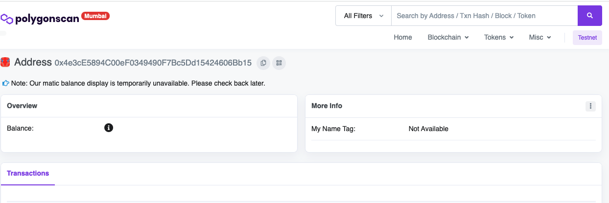
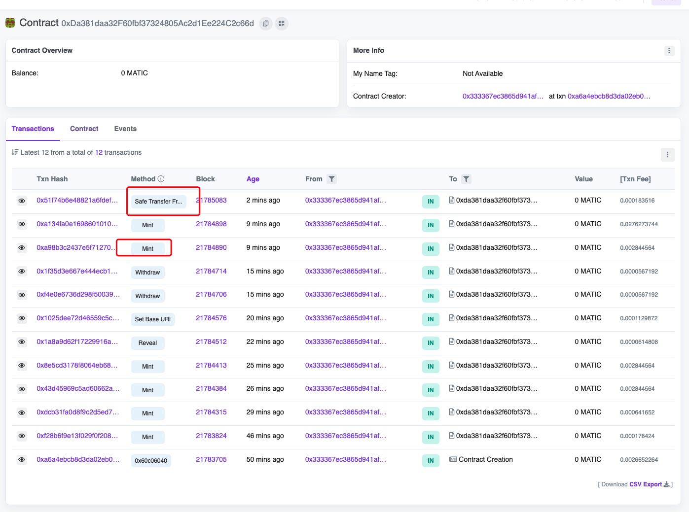

<!-- TOC -->

- [web3](#web3)
  - [Smart Contracts](#smart-contracts)
    - [1. 如何发布合约？](#1-如何发布合约)
      - [Step1 初始化项目](#step1-初始化项目)
      - [Step2 配置 Polygon 测试环境](#step2-配置-polygon-测试环境)
      - [Step3 发布合约](#step3-发布合约)
  - [公链 联盟链](#公链-联盟链)

<!-- /TOC -->

# web3

## Smart Contracts

### 1. 如何发布合约？

#### Step1 初始化项目
创建项目目录:

```
mkdir polygon-nft
```
进入项目目录，使用 hardhat 工具初始化项目：

```
npm install --save-dev hardhat 
npx hardhat
```
第二个命令将引导你完成一些配置工作。选择示例项目选项，然后接受之后显示的所有默认选项。完成该过程后，项目文件夹中将包含一些新文件。在代码编辑器中打开整个项目文件夹，让我们看一下目录内容：

```
polygon-nfts
  |- contracts
      |- Greeter.sol
  |- scripts
      |- sample-script.js
  |- test
      |- sample-test.js
  |- .gitignore
  |- hardhat.config.js
  |- package-lock.json
  |- package.json
```
contracts 目录就是我们放置合约的目录

scripts 存放发布的脚本

test 存放测试脚本（hardhat 支持我们在本地测试合约）

`hardhat.config.js` 文件存放的是 hardhat 的一些基本配置，例如配置 合约部署的链、发布合约的用户等…

#### Step2 配置 Polygon 测试环境
上面我们说到 `hardhat.config.js` 文件配置的是 合约需要部署的链、发布合约的用户等信息。那么如果我们希望配置 polygon 测试链的话，就需要从中进行配置。文件中找到 `module.exports` 对象。它可能仅包含 Solidity 版本的定义。让我们用以下代码替换之前的 `module.exports`：

```js
module.exports = {
  defaultNetwork: "matic",
  networks: {
    hardhat: {
    },
    matic: {
      url: "https://rpc-mumbai.maticvigil.com", // polygon 测试链
      accounts: [PRIVATE_KEY] // 发布合约的用户私钥
    }
  },
  solidity: {
    version: "0.8.4",
    settings: {
      optimizer: {
        enabled: true,
        runs: 200
      }
    }
  },
  paths: {
    sources: "./contracts",
    tests: "./test",
    cache: "./cache",
    artifacts: "./artifacts"
  },
  mocha: {
    timeout: 20000
  }
}
```
为了保证私钥不泄露，我们不能在配置中明文编写私钥；故而使用 `PRIVATE_KEY` 的方式来代替。

如果还没有钱包的话，可以在 MetaMask 上创建钱包账号，具体可参考：创建 MetaMask 钱包，创建完后需要去获取 polygon 测试网的代币


#### Step3 发布合约
在发布合约前，我们可以先编译合约 npx hardhat compile，编译成功会生成 ABI 文件。


然后我们就可以使用命令发布合约:

```
npx hardhat run scripts/sample-script.js --network matic
```
然后可以看到输出的合约地址 0x4e3cE5894C00eF0349490F7Bc5Dd15424606Bb15；再之后就可以直接去 [PolygonScan测试链](https://mumbai.polygonscan.com/) 上查看部署的合约。



2. 如何访问链上合约？
访问链上合约实际上是发起一笔交易，从交易的角度来看；那么需要三个元素： 合约地址、合约ABI、调用方个人钱包信息。

合约地址：在部署合约的时可以获取。

合约ABI：Application Binary Interface，应用程序二进制接口；可以理解为合约的接口文档。当合约被编译后，会自动生成（JSON串）。

调用方个人钱包：调用合约函数，犹如发起一笔交易；那必然是需要提供调用方的钱包（这点当时没想通，卡了不少时间）。

ether.js
我们将通过 ether.js 来对链上合约进行访问

```js
const {ethers} = require('ethers')
// 希望访问的合约的ABI文件
const {abi} = require('../artifacts/contracts/NGNFToken.sol/NGNFToken.json')
// Provider 是一个连接以太坊网络的抽象，用与查询以太坊网络状态或者发送更改状态的交易。
let provider = new ethers.providers.JsonRpcProvider("https://rpc-mumbai.maticvigil.com")

// 理论上不能直接暴露个人的私钥
let privateKey = "eecf3fe4a6bd0948b3fcc94b4ec12936d8970267e8bbbc33c04f50a9072e84a3"
let wallet = new ethers.Wallet(privateKey, provider)
let userAddress = wallet.address

// 查询个人钱包余额
provider.getBalance(userAddress).then((balance) => {
  console.log("balance:" + balance)
})
// 合约地址 & 创建合约对象
let contractAddress = "0xDa381daa32F60fbf37324805Ac2d1Ee224C2c66d";
let contractWithSigner = new ethers.Contract(contractAddress, abi, wallet)

// 通过合约对象调用合约的各个 public 方法，具体方法需要查看 .sol 文件
// 发行 NFT
contractWithSigner.mint(100).then((data) => {
  for (let i = 0; i<data.length; i++) {
    console.log("txHash: " + data[i])
  }
}).catch(err => {
  console.log("err:" + err)
})

```



## 公链 联盟链